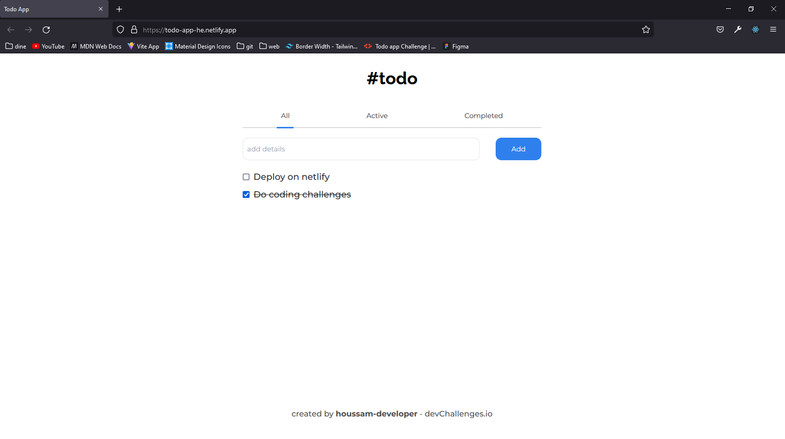

<!-- Please update value in the {}  -->

<h1 align="center">Todo App</h1>

<div align="center">
   Solution for a challenge from  <a href="http://devchallenges.io" target="_blank">Devchallenges.io</a>.
</div>

<div align="center">
  <h3>
    <a href="https://todo-app-he.netlify.app/">
      Demo
    </a>
    <span> | </span>
    <a href="https://github.com/houssam-developer/todo-app">
      Solution
    </a>
    <span> | </span>
    <a href="https://devchallenges.io/challenges/hH6PbOHBdPm6otzw2De5">
      Challenge
    </a>
  </h3>
</div>

<!-- TABLE OF CONTENTS -->

## Table of Contents

- [Overview](#overview)
  - [Built With](#built-with)
- [Features](#features)
- [How to use](#how-to-use)
- [Contact](#contact)
- [Acknowledgements](#acknowledgements)

<!-- OVERVIEW -->

## Overview



This Todo App page can be found here: "https://todo-app-he.netlify.app//".
Thanks to that challenge, I learn to work efficiently in order to succeed.
And I hope to make more beautifuls websites and become an expert in front-end developmemt :)

### Built With

<!-- This section should list any major frameworks that you built your project using. Here are a few examples.-->

- [HTML]
- [CSS] 
- [React] (https://reactjs.org/)
- [React-Icons] (https://react-icons.github.io/react-icons/)
- [Vite] (https://vitejs.dev/)

## Features

<!-- List the features of your application or follow the template. Don't share the figma file here :) -->

This application/site was created as a submission to a [DevChallenges](https://devchallenges.io/challenges) challenge. The [challenge](https://devchallenges.io/challenges/hH6PbOHBdPm6otzw2De5) was to build an application to complete the given user stories.

Challenge: Create a todo app following given designs. Use Front-end libraries like React or Vue. Don’t look at the existing solution. Fulfill user stories below:

- User story: I can add a new task
- User story: I can complete a task
- User story: I can toggle between All, Active and Completed
- User story: I can remove one or all tasks under the Completed tab
- User story (optional): Store the data in local storage that when I refresh the page I can still see my progress

Icon: https://google.github.io/material-design-icons/

## How To Use

<!-- Example: -->

To clone and run this application, you'll need [Git](https://git-scm.com) and [Node.js](https://nodejs.org/en/download/) (which comes with [npm](http://npmjs.com)) installed on your computer. From your command line:

```bash
# Clone this repository
$ git clone https://github.com/houssam-developer/todo-app

# Install dependencies
$ npm install

# Run the app
$ npm run dev
```

## Acknowledgements

<!-- This section should list any articles or add-ons/plugins that helps you to complete the project. This is optional but it will help you in the future. For exmpale -->

- [Steps to replicate a design with only HTML and CSS](https://devchallenges-blogs.web.app/how-to-replicate-design/)
- [Node.js](https://nodejs.org/)
- [React] (https://reactjs.org/)
- [Vite] (https://vitejs.dev/)
- [Marked - a markdown parser](https://github.com/chjj/marked)

## Contact

- Website [todo-app-he.netlify.app](https://todo-app-he.netlify.app)
- GitHub [@houssam-developer](https://github.com/houssam-developer/todo-app)